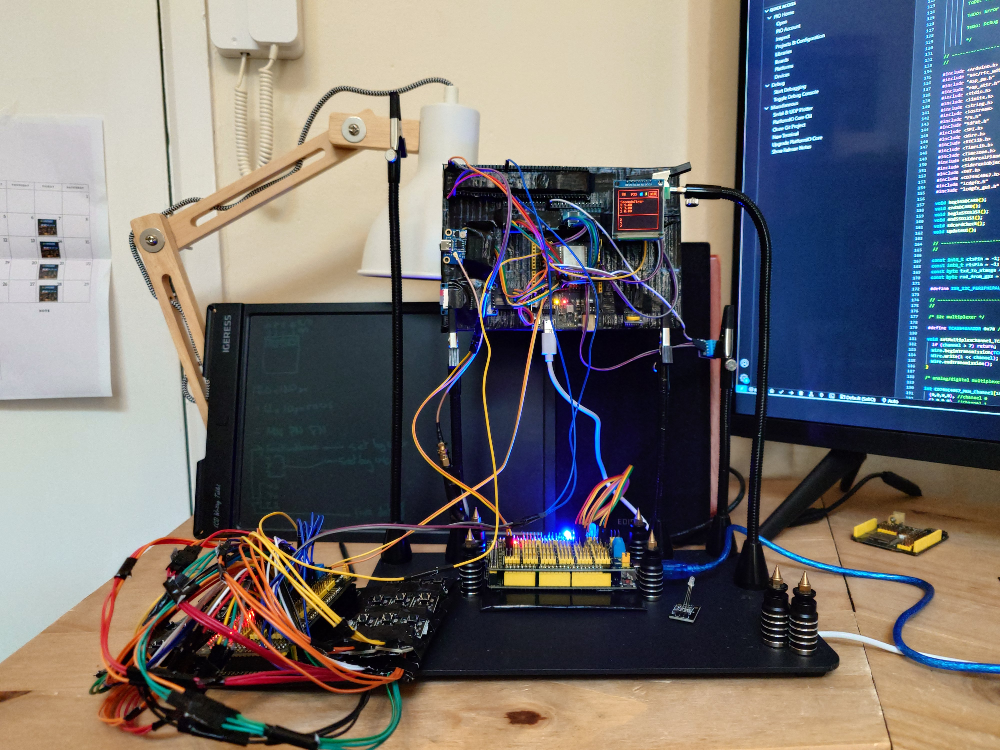
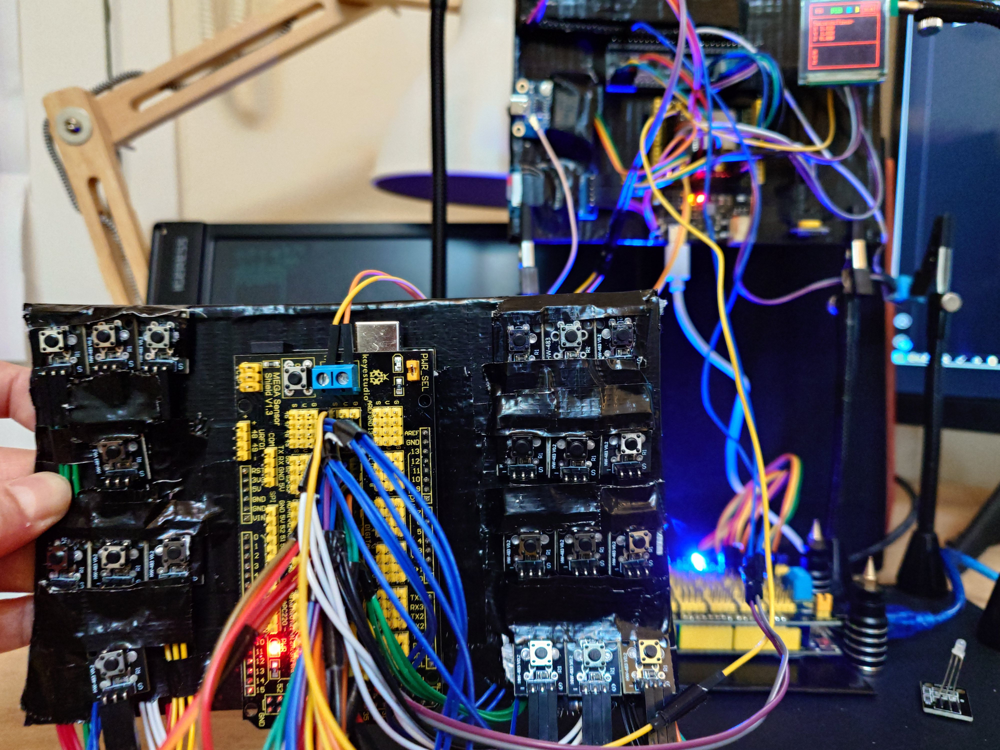
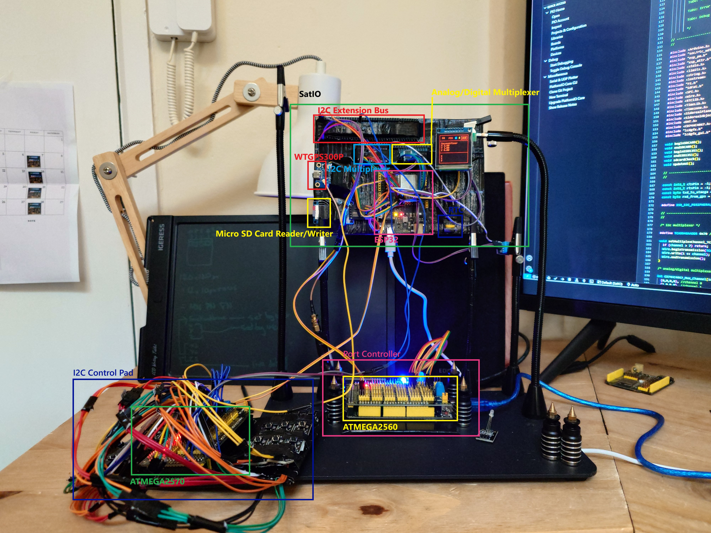

                                        SatIO - Written by Benjamin Jack Cullen.

                                                   "The GPS Master"

                          A general purpose programmable satellite, sensor and inertial platform.

                                     SatIO is the system, a matrix is the program.

            Design: Break out all the things and build I2C peripherals as required to orbit the ESP32/Central-MCU.

                                    
                                    Wiring For Keystudio ESP32 PLUS Development Board

                                          ESP32: 1st ATMEGA2560 with sheild as Port Controller custom peripheral (for large creative potential out) (Not on multiplexer):
                                          ESP32: I2C SDA -> ATMEGA2560: I2C SDA
                                          ESP32: I2C SCL -> ATMEGA2560: I2C SCL

                                          ESP32: 2nd ATMEGA2560 with sheild as Control Panel custom peripheral (for large creative potential in) (Not on multiplexer):
                                          ESP32: io25    -> ATMEGA2560: io22
                                          ESP32: I2C SDA -> ATMEGA2560: I2C SDA
                                          ESP32: I2C SCL -> ATMEGA2560: I2C SCL

                                          Other ESP32 i2C Devices (Not on multiplexer):
                                          ESP32: SDA0 SCL0 -> DS3231 (RTC): SDA, SCL (5v)

                                          ESP32: WTGPS300P (5v) (for getting a downlink):
                                          ESP32: io27 RXD -> WTGPS300P: TXD
                                          ESP32: null TXD -> WTGPS300P: RXD

                                          ESP32 i2C: i2C Multiplexing (3.3v) (for peripherals):
                                          ESP32: i2C -> TCA9548A: SDA, SCL

                                          ESP32: Analog/Digital Multiplexing (3.3v) (for peripherals):
                                          ESP32: io4    -> CD74HC4067: SIG
                                          ESP32: io32   -> CD74HC4067: S0
                                          ESP32: io33   -> CD74HC4067: S1
                                          ESP32: io16   -> CD74HC4067: S2
                                          ESP32: io17   -> CD74HC4067: S3
                                          CD74HC4067 C0 -> DHT11: SIG

                                          ESP32 VSPI: SDCARD (5v) (for matrix and system data):
                                          ESP32: io5  -> HW-125: CS (SS)
                                          ESP32: io23 -> HW-125: DI (MOSI)
                                          ESP32: io19 -> HW-125: DO (MISO)
                                          ESP32: io18 -> HW-125: SCK (SCLK)

                                          ESP32 HSPI: SSD1351 OLED (5v) (for interfacing):
                                          ESP32: io14 -> SSD1351: SCL/SCLK
                                          ESP32: io12 -> SSD1351: MISO/DC
                                          ESP32: io13 -> SSD1351: SDA
                                          ESP32: io26 -> SSD1351: CS

                                                  SENTENCE $SATIO

                                                      System Uptime                    
                  Tag                  Last Sync      |                               Degrees Longitude        
                  |      yyyymmddhhmmss|yyyymmddhhmmss|s|hh.mm|hh.mm|                 |                 |                
                  $SATIO,00000000000000,00000000000000,0,00.00,00.00,00.00000000000000,00.00000000000000,*Z
                        |              |                |     |     |                 |                 |            
                        RTC Datetime                    |     |     Degrees Latitude                    Checksum            
                                                        |     Sun Set
                                                        Sun Rise

      Use case: From a clock syncronized with satellites to riding the INS (roll, pitch, yaw) on a fine line to within a certain degree of
                                    expected drift, if GPS data is stale or unavailable.
                        Robots, flying machines and automation, or for use with local LLM's like ollama, anything.

      Bare bones architecture: SatIO is an extended development platform built on and around ESP32, allowing for many different kinds of projects
      using SatIO as a standalone system and or integrating SatIO into other systems as a 'part'.
                                              Extended I2C
                                              Extended Analogue/Digital.
                                              Supports Extended VSPI and HSPI.
                                              Extended IO (using an ATMEGA2560).
      
      Flexibility: The system is designed to be highly flexible, so that input/output/calculations of all kinds can be turned on/off for different use cases,
      including simply returning calculated results from programmable matrix as zero's and one's over the serial for another system to read. Serial
      output is modular so that depending on the use case, transmission over serial can be more efficient and specific, this expands the creative
      potential of using satio, like letting an LLM on another system know what satio knows for one example.

      Port Controller: ESP32 receives sensory data, calculates according to programmable matrix, then instructs the port controller to turn pins high/low
      according to results from the calculations. The pins could be switching led's, motors or microconrtollers for some examples.

      UI: Allows programming matrix switch logic and tuning for individual use cases.
      Focus is payed to emphasis to importance, consistancy and clarity, nothing more, this keeps things simple, practical and efficient, in turn being better for performance.
      
      Summary: A satellite, inertial and sensor value calculator and switch with over one quintillion possible combinations of stackable logic accross 20 switches
      for a general purpose part, subsystem or standalone device. Because there is so much information from and that can be calculated from a gps module like the
      WTGPS300, it may sometimes be preferrable and useful to have one system to handle the data, rather than requiring a quintillion different systems over time.

      Whats to gain? From this project I intend to have reusable, general purpose parts, namely a programmable navigation system, control pad and port controller
      that I can use for other projects in the future. For now I imagine each part will be an I2C device and some parts like SatIO will have both master and slave
      modes for flexibility accross differnt project requirements. 

        ToDo: Latitude and longitude terrain elevation dictionary. This ties in with SatIO basically knowing and being able to calculate with a lot of 'constants'.
        This may be sourced from NASA's Shuttle Radar Topography Mission to provide a topographic resolution of 1 arc second (about 30 meters).
        After experimentation I found that extraction of one hgt file on esp32 took 7 minutes and also found that subsequent searching of that hgt file for elevation
        data also took over 5 minutes. The extraction time we can work with (with a large enough micro sd card) by extracting only what we need within a certain 
        range of degrees, but time to read elevation data has to be quick and it is not. Maybe its just me and there are better ways than I have tried, i will be
        saving this feature for a version of SatIO built around something more powerful than ESP32.  

        Todo: wire up the existing functionality through to the interface level.

        ToDo: esp32 has a NIC, host an RSS feed for local/remote parsing that can be enabled/disabled.

        ToDo: override/input passthrough: setup for special input controls that can override variable output pins on the port controller (satio drives you/you drive satio).
              (redirects joysticks/trigger input to output, variably). requires a special menu page where any given analogue input controls can be calibrated
              and mapped to within certain thresholds for stabalizing input as required per analogu input device.
  
        ToDo: Black capped (occasionally alien green) grey cherry mx switches for the control panel (80 cN operating force takes more pressure than other switches).

        ToDo: Documentaion.

        ToDo: Serial commands. Reinstate original interface over serial capabilities for programability from another computer.

        ToDo: Simple Solar System in real-time on home page. And other options for homepage like matrix switch view (view of all switch states).

        ToDo: Test sequence.

        ToDo: Error codes.

        ToDo: Debug messages.

---

SatIO with I2C Port Controller and I2C Control Pad:

---

I2C Control Pad:

---

SatIO and module devices:

---

       Requires using modified SiderealPlanets library (hopefully thats okay as the modifications allow calculating rise/set
       of potentially any celestial body as described in this paper: https://stjarnhimlen.se/comp/riset.html)

---
