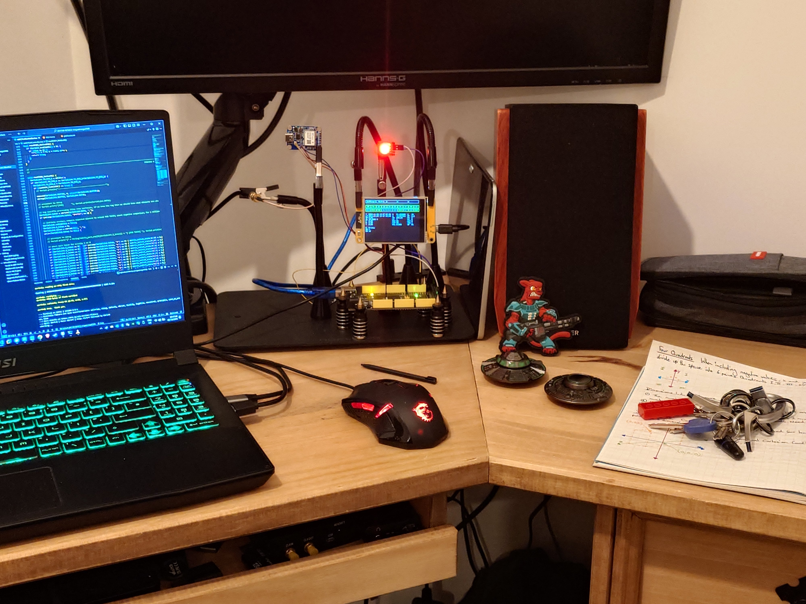

#                                                        SatIO

This version is for the CYD (Cheap Yellow Display) Written by Benjamin Jack Cullen.

---
                                                         SatIO
                                                   "The GPS MAster"

                              A general purpose programmable satellite and inertial switch.

                                      SatIO is the system, a matrix is the program.

            Receives and Processes Transmissions from Satellites and makes the data available for calculations.

            Possible combinations example: 

    10=digit characters   15=lenght of double   3=doubles per function   10=functions per switch   20=switches  190=available functions
                                              (((10^15 * 3) * 10) * 20) ^ 190

        Currently there are over 200 different checks that can be performed using just several small primitive functions and
          currently each matrix activation/deactivaion can occur based on up to 10 different checks resulting true or false. 
          

                                                        $SATIO SENTENCE
                                                    
                                                                                
                        START Tag                Last Sat Time                    Converted Longitude        
                          |                   |               |                   |               |                  
                        $SATIO,000000000000.00,000000000000.00,00.00000000000000,00.00000000000000,*Z
                              |               |               |                 |                              
                                DatetimeStamp                  Converted Latitude                                 

        Ultimately this system is being built as a unit to turn on/off IO/GPIO/relays and or send messages to other controllers,
                  where potentially anything can be plugged in such as simple modules or pre-programmed MCU's, 
            making a foundation for other creative projects that may make use of such satellite and or inertial data.
                The idea is that each matrix is a compound of logic (limited by memory), and the logic itself
            is programmable before and after flashing. Allowing for a reusable and general purpose system for any future
                                            projects requiring use of GPS data. 
                                        Robots and flying machines and automation.

                            The IO is virtualized as well as physical (requires SatIO Port Controller)
  

---

---

---

---
  
       Requires using modified SiderealPlanets library (hopefully thats okay as the modifications allow calculating rise/set
       of potentially any celestial body as described in this paper: https://stjarnhimlen.se/comp/riset.html)

---
