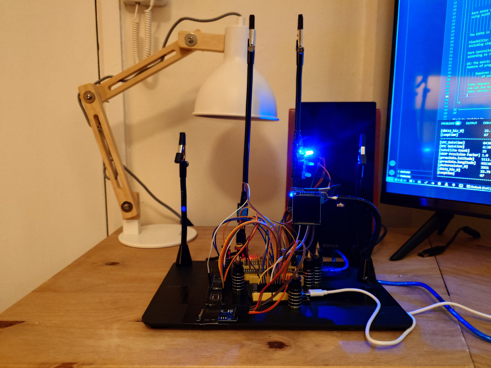
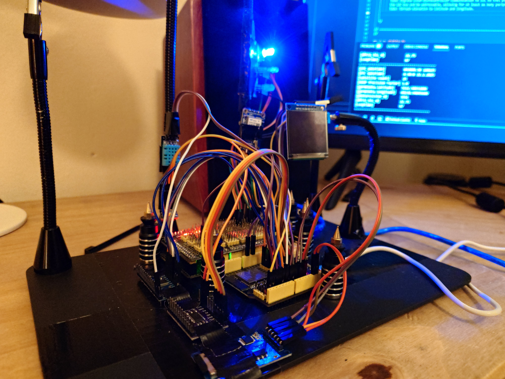
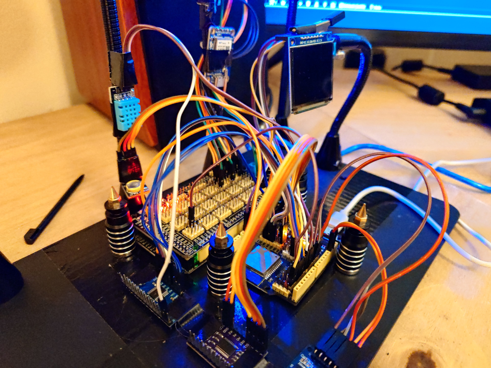

                                        SatIO - Written by Benjamin Jack Cullen.

                                                   "The GPS Master"

                          A general purpose programmable satellite, sensor and inertial platform.

                                     SatIO is the system, a matrix is the program.

                                    
                                    Wiring For Keystudio ESP32 PLUS Development Board

                                          ESP32: ATMEGA2560:
                                          ESP32: io25 TXD -> ATMEGA2560: Serial1 RXD
                                          ESP32: null RXD -> ATMEGA2560: Serial1 TXD

                                          ESP32: WTGPS300P (5v):
                                          ESP32: io27 RXD -> WTGPS300P: TXD
                                          ESP32: null TXD -> WTGPS300P: RXD

                                          ESP32 i2C: i2C Multiplexing (3.3v):
                                          ESP32: i2C          -> TCA9548A: SDA, SCL
                                          TCA9548A: SDA0 SCL0 -> DS3231: SDA, SCL (5v)

                                          ESP32: Analog/Digital Multiplexing (3.3v):
                                          ESP32: io4  -> CD74HC4067: SIG
                                          ESP32: io32 -> CD74HC4067: S0
                                          ESP32: io33 -> CD74HC4067: S1
                                          ESP32: io16 -> CD74HC4067: S2
                                          ESP32: io17 -> CD74HC4067: S3
                                          CD74HC4067 C0 -> Photo Resistor: SIG
                                          CD74HC4067 C1 -> DHT11: SIG

                                          ESP32 VSPI: SDCARD (5v):
                                          ESP32: io5  -> HW-125: CS (SS)
                                          ESP32: io23 -> HW-125: DI (MOSI)
                                          ESP32: io19 -> HW-125: DO (MISO)
                                          ESP32: io18 -> HW-125: SCK (SCLK)

                                          ESP32 HSPI: SSD1351 OLED (5v):
                                          ESP32: io14 -> SSD1351: SCL/SCLK
                                          ESP32: io12 -> SSD1351: MISO/DC
                                          ESP32: io13 -> SSD1351: SDA
                                          ESP32: io26 -> SSD1351: CS

                                                  SENTENCE $SATIO
                                                                          
                  START Tag                Last Sat Time                    Converted Longitude        
                    |                   |               |                   |               |                  
                  $SATIO,000000000000.00,000000000000.00,00.00000000000000,00.00000000000000,*Z
                        |               |               |                 |                              
                          DatetimeStamp                  Converted Latitude                                 

      Use case: From a clock syncronized with satellites to riding the INS (roll, pitch, yaw) on a fine line to within a certain degree of
                                    expected drift, if GPS data is stale or unavailable.
                                        Robots, flying machines and automation.

      Bare bones architecture: SatIO is an extended development platform built on and around ESP32, allowing for many different kinds of projects
      using SatIO as a standalone system and or integrating SatIO into other systems as a 'part'.
                                              Extended I2C
                                              Extended Analogue/Digital.
                                              Extended VSPI and HSPI.
                                              Extended IO (using an ATMEGA2560).
      
      Flexibility: The system is designed to be highly flexible, so that input/output/calculations of all kinds can be turned on/off for different use cases,
      including simply returning calculated results from programmable matrix as zero's and one's over the serial for another system to read.

      Port Controller: ESP32 receives sensory data, calculates according to programmable matrix, then instructs the port controller to turn pins high/low
      according to results from the calculations.

      UI: The matrix has been programmable via the UI however the UI has only just been reinstated, after focusing on performance and architecture. The
      feature of programming the matrix through switches and UI will be reimplemented. Until then, the matrix can be hardcoded for testing purposes.

              Requires using modified SiderealPlanets library (hopefully thats okay as the modifications allow calculating rise/set
                  of potentially any celestial body as described in this paper: https://stjarnhimlen.se/comp/riset.html)
                  
                  ToDo: Migrate inter-microcontroller communication to i2C so that peripheral devices (like the port controller) can be put straight on
                  the i2C bus and be addressable, allowing for at least as many peripheral devices as there are i2C addresses (x i2C multiplexer channels).

---

---

---

---
  
       Requires using modified SiderealPlanets library (hopefully thats okay as the modifications allow calculating rise/set
       of potentially any celestial body as described in this paper: https://stjarnhimlen.se/comp/riset.html)

---
